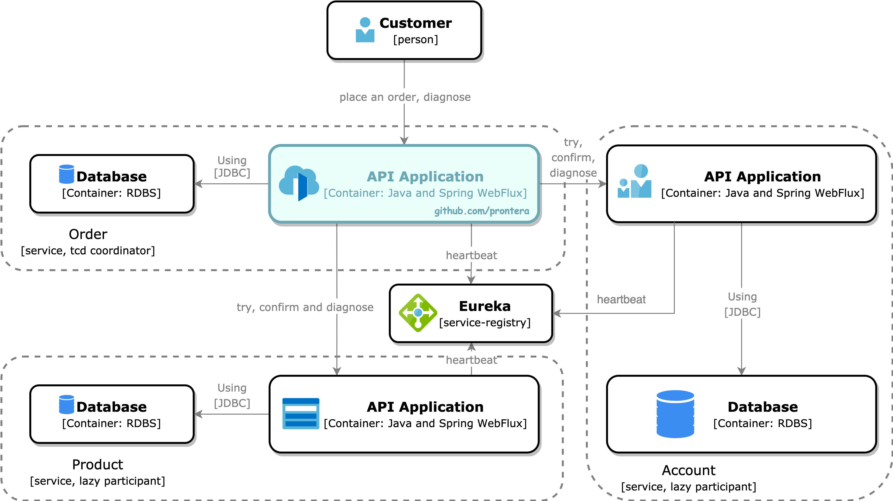
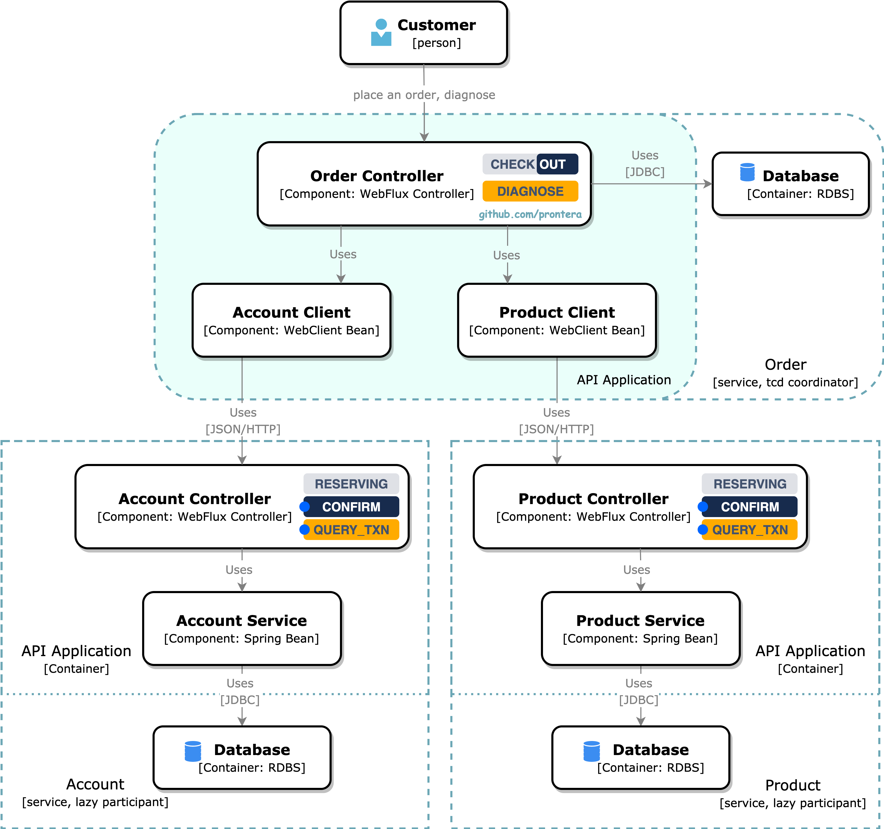

# spring-cloud-rest-tcc

## Preface

随着业务的发展，不断对现有系统进行析构与拆分，所带来的其中一个关注点是分布式事务，是一个协作问题。针对分布式事务，Atomikos曾经写过一篇文章[TCC for transaction management across microservices](https://link.jianshu.com/?t=https://www.atomikos.com/Blog/TCCForTransactionManagementAcrossMicroservices)，介绍如何使用TCC作为的微服务分布式事务的解决方案，[这里](https://www.jianshu.com/p/d687b620f73d)有一篇简单的译文可作为入门资料。

经简单的阅读后可以得知，Atomikos最初设计出一套RESTful TCC的交互API，且充分地使用了HTTP的语义特性，完整复用HTTP原生响应码，甚至自定义MIME类型，是一个完全面向HTTP的解决方案，而究其本质，TCC实际上是一种思想。

本文使用Spring Cloud Netflix作为服务治理基础，侧重于以最精简的依赖向大家展示如何使用TCC解决分布式事务，并在叙述过程中引出对分布式系统子问题的思考。

## Variants

在micro-service兴起的时候，它的交互方式早已不限于HTTP。面对性能要求，更多的是以RPC的实现方式落地，如gRPC、Dubbo和Thrift等通信框架。基于TCC的设计思想，应该以更为通用和温和的方式落地，我们将以不同的角度阐述这种TCC的"变体"。

在模型上，将原有的HTTP语义下沉到请求体当中，上下游各自定义status code，用于识别不同状态。

在流程上，从Try-Confirm-Cancel演进为Try-Confirm-Diagnose，也就是TCC到TCD的一种变迁，将Try和Confirm抽象为API接口，而原生的Cancel不再与Try-Confirm平级，从API接口降级为辅助功能融合至Try和Confirm的方法当中，coordinator仅对下游做confirm操作，避免因拜占庭错误而轮转至conflict状态。即便是出现conflict状态，可以通过Diagnose接口作出诊断，追踪坏账以便人工介入。

出于对知识的敬重与措辞的严谨性，下文统一使用TCD指代该种TCC变体，不会混淆使用。

## Role

假设我们想买一台PS4，在付款后需要历经生单、扣减余额和商品库存这三个过程，分别对应服务Order、Account和Product，但每一个过程中都可能会因为网络故障、宕机、网络分区或者拜占庭问题而产生各式各样的问题。

### Coordinator

#### TCC Coordinator

Transaction Coordinator delivered as a service，Atomikos支持将TCC Coordinato服务化，成为一个可重用组件，负责处理各式各样异常情况，例如failure recover后事务的恢复。

首先，从交互方面看，对于RESTful TCC来说，这是一个可行的方案，因为RESTful天生具备容易访问的基因，而RPC的劣势在于序列化协议之间的屏障，无法做到如micrometer和service mesh理念中的vendor-neutral，所以在社区推广性上相对乏力。

另外，从实现成本方面看，试想服务TCC Coordinator在confirm同一事务内的若干资源时发生crash（partial confirm），想要达成failure recover，付出一定的存储成本是必要条件。并且为了成为可信任的组件，TCC Coordinator需要具备故障自动迁移的能力，那么在crash之后，需要将当前机器相关的confirmation-task迁移到其他机器，很明显，需要有heartbeat检测机制，而且当前属于有状态应用。

再进一步，抛开迁移的手段，一旦TCC Coordinator的QPS过高，无法将就使用的时候，进行大批量的confirmation-task迁移会直接使得被迁机器迅速成为系统的性能短板。此时所暴露出的系统性问题，也应该意识到属于共识问题，需要选出leader作为协作者，根据机器在集群中的存活情况**均匀地**分配confirmation-task。

既需要集群存活情况，也需要heartbeat检测，刚好就跟注册中心service-discovery对上，是不是直接就可以拿来主义呢？答案也是否定，万一产生network-partition，AP类型的注册中心会产生意想不到的结果，正如eureka peer组网，出于对租约信息保护，两个网络分区之间获取到的注册信息未必一致。

几经波折，终于选对了注册中心，或者直接使用RDBS自行实现，但面对应用重启发布时仍需注意反复对confirmation-task进行rebalance的问题，并且为了能实现均匀分配，对原本使用hostname对confirmation-task进行染色的方法进行改造，提炼出virtual node或partition的概念，改为使用partition对confirmation-task进行染色，这样也直接将应用从有状态优化至无状态。每当leader检测到follower crash的时候，就能检索出该机器所负责的partition，均匀地分发给其他机器，这就是rebalance操作。

现在终于能成为一个比较称职的TCC Coordinator了，同时也造出一个mini Kafka，维护成本相当可观。

#### TCD Coordinator

TCC Coordinator为了成为一个可复用的服务，一方面面临着序列化协议的天然屏障，另一方面还需面对巨大的维护成本，这两方面的因素除了有来自服务拆分所带来的复杂性，更多来自服务边界的划分。

##### 区别

1. 当自身作为发起方，并且需要让service内的其他机器均分任务的话，上述的分析可以成为解决方案之一，但实际上TCC Coordinator作为流量接收方，完全可以借力打力，通过与上游磋商重试策略，将可靠性保证的责任分摊到上游，并且通过RPC通信框架中天然的load-balance，使得每台机器都负载均衡。

2. TCD Coordinator不再作为独立服务，而是整合到应用当中。其次，面对如此重要的事务，而TCC Coordinator作为黑盒形式提供的组件，心理上会产生一定的抗拒。

##### 职责

1. 组织并负责发起TCD事务
2. 提供诊断conflict事务的Diagnose语义的门面API
3. 提供发起TCD事务的接口，需实现幂等性
4. 仅对下游发起Try与Confirm操作，避免既出现Confirm又出现Cancel操作的拜占庭问题
5. 针对下游发起Try操作时，负责计算预留资源时间，并适当考虑下游因GC情况而所需要增加补偿时间

### Lazy Participant

惰性参与者，Participant无需启用调度器自发地将过期的TRYING状态资源轮转至CANCELLED状态，而是将这个功能隐藏在Try和Confirm的接口当中，可以说TCD事务是由TCD Coordinator驱动，以减少事务参与者的开发成本，专注于正确的状态轮转即可。

##### 职责

1. 提供Try操作的预留资源API接口
2. 提供Confirm操作的确认预留资源API接口，并在内部负责对过期资源的状态轮转
3. 提供事务状态查询的API接口，并在内部负责对过期资源的状态轮转
4. 对Try和Confirm两个接口，实现幂等性调用

## C4 Model

### System Context Diagram

### Container Diagram

### Component Diagram

## Final State Machine

### Coordinator

### Participant

## Rock and roll !

### Prerequisites

### Technology stack

## Question